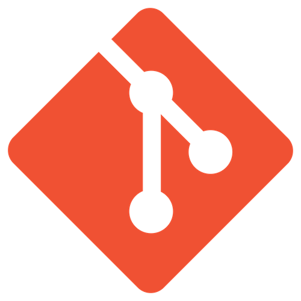

<h2 align="center"> Hi there, i am Caique! 👋 </h2>

    <a target="_blank" href="https://www.linkedin.com/in/caique-campos1996/" > 
         
        &nbsp;
    </a>

  
  &nbsp;

  <!--
  &nbsp; -->

<!-- <h3 align="center"> I am Caique! </h3> -->

 I'm a Physics undergraduate student changing to Software development. Currently focusing on front-end development through a coding bootcamp at <a target="_blanck" href="https://digitalinnovation.one/">Digital Innovation One</a>. Feel free to contact me and please take a look around! :wink:

 
 
<h2 align="center"> My Stack </h2>

  
  
 
  
 
  
  
  
  
  
  
  

  
 
  
  
  
  

  Part of my stack is based in previous knowledge developed in college. 
  I was involved with some academic activities that required programming skills 
  such as algorithms and data structures courses (using C), numeric 
  algorithms implementation and data analysis scripts (with Python).
  I also worked developing full automatic scripts for simulation and data 
  analysis in a framework based in C++ 
  (<a target="_blank" href="https://root.cern/"> ROOT </a> from CERN) in my scientific initiation.

    Icons made by <a href="https://www.freepik.com" title="Freepik">Freepik</a> from <a href="https://www.flaticon.com/" title="Flaticon">www.flaticon.com</a>

<h3 align="center"> Projects </h3>

  SOON!

<h3 align="center"> Interests </h3>
<ul>
  <li> Reactjs and React Native </li>
  <li> Node.js </li>
  <li> .NET </li>
  <li> (Non) Relational Databse Management Systems </li>
  <li> Agile Methodologies such as SCRUM </li>
  <li> Software architecture </li>
  <li> Docker </li>
  
</ul>

<!-- Metrics -->

     

